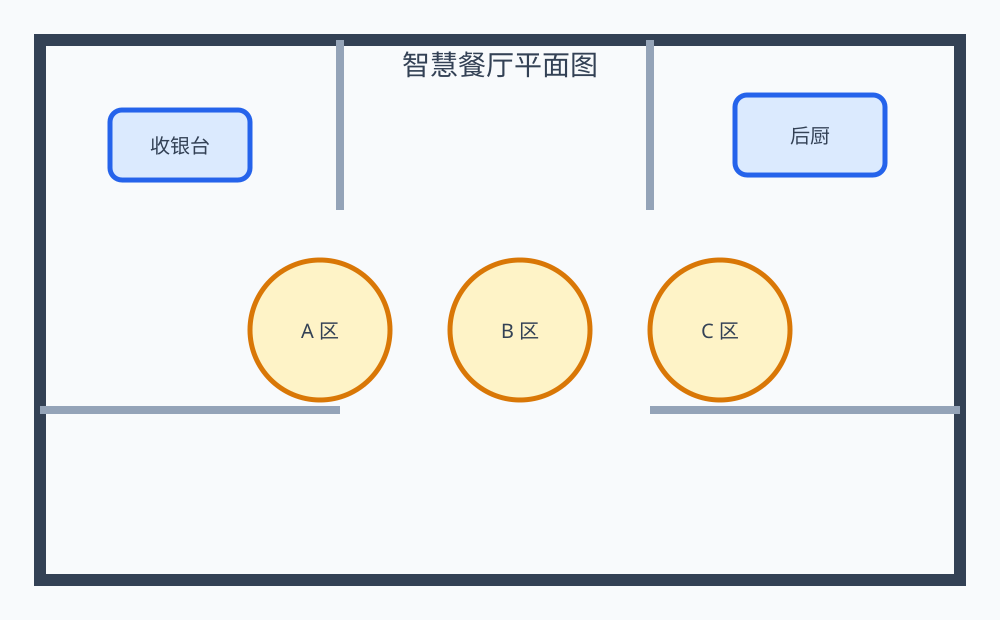

# Image Hotspot Demo

一个可以本地直接启动的“上传图片 → 可视化打点 → 关联商品 → 保存草稿 → 发布展示”完整 Demo。

- 后端：Spring Boot 3.4 + Java 17
- 前端：原生 HTML / CSS / JavaScript，无 Node.js 构建步骤
- 存储：本地 JSON 文件 + 本地图片目录
- 启动：Maven Wrapper 或 Docker Compose

[](https://github.com/JoyHsin002/image-hotspot-demo/actions/workflows/ci.yml)



## 功能

### 配置后台

- 上传 PNG、JPEG、GIF、WebP，最大 10 MB
- 一键创建带 4 个商品点位的内置示例
- 点击图片新增点位
- 拖拽调整位置
- 方向键微调；按住 `Shift` 使用更大步长
- 50%～200% 编辑画布缩放，缩放不改变保存坐标
- 点位复制、删除、列表选择
- 从后端 Mock 商品库搜索并快速关联商品
- 手工编辑商品编码、名称、价格、图片、简介和详情链接
- 自定义每个点位颜色
- 草稿与已发布版本分离
- 离开页面前提示未保存修改
- 单场景最多 100 个点位

### 展示页面

- 单独的展示页
- 草稿预览 / 已发布版本切换
- 按 0～1 相对坐标响应式渲染
- 点击点位弹出商品详情
- 支持商品图片、价格、介绍和详情链接
- 手机、平板、桌面端自适应

### 后端

- REST API
- 本地 JSON 持久化
- 图片文件头检测，不只依赖扩展名或 Content-Type
- 上传路径安全校验
- 商品 URL 仅允许 `http`、`https` 或站内根路径
- `scenes.json` 原子写入
- 统一错误响应
- Mock 商品搜索接口
- Spring Boot 集成测试
- Dockerfile、Docker Compose、GitHub Actions CI

## 环境要求

本地启动需要：

- JDK 17
- 首次启动时能访问 Maven Central 下载 Maven Wrapper 和依赖

检查 Java：

```bash
java -version
```

输出中应包含 `17`。

## 本地启动

### macOS / Linux

```bash
git clone https://github.com/JoyHsin002/image-hotspot-demo.git
cd image-hotspot-demo
chmod +x mvnw
./mvnw spring-boot:run
```

### Windows

```powershell
git clone https://github.com/JoyHsin002/image-hotspot-demo.git
cd image-hotspot-demo
mvnw.cmd spring-boot:run
```

启动后打开：

| 页面 | 地址 |
|---|---|
| 首页 | `http://localhost:8080/` |
| 配置后台 | `http://localhost:8080/editor.html` |
| 展示页面 | `http://localhost:8080/viewer.html` |

第一次体验建议进入配置后台，点击 **一键创建示例**。它会自动复制仓库中的测试平面图、生成 4 个点位并发布。

## Docker 启动

```bash
docker compose up --build
```

访问：

```text
http://localhost:8080/editor.html
```

Docker Compose 会把运行数据挂载到项目根目录的 `data/`。

## 数据保存位置

默认目录：

```text
data/
├── scenes.json
└── uploads/
```

通过环境变量修改：

```bash
HOTSPOT_DATA_DIR=/your/path ./mvnw spring-boot:run
```

该存储方案用于保证 Demo 零外部依赖。正式系统建议替换为 MySQL/PostgreSQL，并将图片存入 OSS、S3 或 MinIO。

## API

### 查询场景列表

```http
GET /api/scenes
```

### 上传并创建场景

```http
POST /api/scenes
Content-Type: multipart/form-data

name=<场景名称>
image=<图片文件>
```

### 创建内置示例

```http
POST /api/scenes/sample
```

### 查询场景详情

```http
GET /api/scenes/{sceneId}
```

场景详情同时返回 `draftHotspots` 和 `publishedHotspots`。

### 保存草稿

```http
PUT /api/scenes/{sceneId}/draft
Content-Type: application/json
```

请求示例：

```json
{
  "hotspots": [
    {
      "id": 1,
      "xRatio": 0.5274,
      "yRatio": 0.3118,
      "label": "智慧收银",
      "markerColor": "#2563EB",
      "product": {
        "code": "POS-01",
        "name": "双屏智能 POS",
        "price": "¥2,999",
        "imageUrl": "/sample/products/pos.svg",
        "description": "支持收银、会员、营销和订单聚合。",
        "detailUrl": "https://example.com/products/pos"
      }
    }
  ]
}
```

### 发布草稿

```http
POST /api/scenes/{sceneId}/publish
```

发布会将当前草稿快照复制为线上版本。

### 删除场景

```http
DELETE /api/scenes/{sceneId}
```

### 搜索 Mock 商品

```http
GET /api/products?q=wifi
```

## 坐标方案

后端保存相对坐标，而不是像素：

```text
xRatio = (点击 X - 图片左边缘) / 图片显示宽度
yRatio = (点击 Y - 图片上边缘) / 图片显示高度
```

前端按百分比渲染：

```javascript
marker.style.left = `${hotspot.xRatio * 100}%`;
marker.style.top = `${hotspot.yRatio * 100}%`;
```

因此同一组点位可以适配不同分辨率和屏幕宽度。

## 运行测试

```bash
./mvnw verify
```

## 项目结构

```text
src/main/java/com/joyhsin/hotspot/
├── HotspotDemoApplication.java
├── SceneController.java
├── SceneService.java
├── SceneStore.java
├── ImageStorageService.java
├── SceneData.java
├── AppProperties.java
└── ApiExceptionHandler.java

src/main/resources/static/
├── index.html
├── editor.html
├── viewer.html
├── assets/
└── sample/
```

## 接入 Spring Cloud 的下一步

这个仓库是本地可运行 Demo。迁入正式项目时建议继续补充：

1. 使用 MySQL 表结构和乐观锁版本号。
2. 将场景、草稿、发布快照拆分为独立表。
3. 商品点位只保存 `productId`，商品信息从商品中心实时读取。
4. 增加租户、角色、数据权限和操作审计。
5. 使用 OSS/MinIO 存储图片并接入 CDN。
6. 增加商品下架、删除后的点位兜底策略。
7. 增加曝光、点击、转化埋点。
8. 需要复杂多边形区域时，再引入 Konva 或 Annotorious。

## License

MIT
