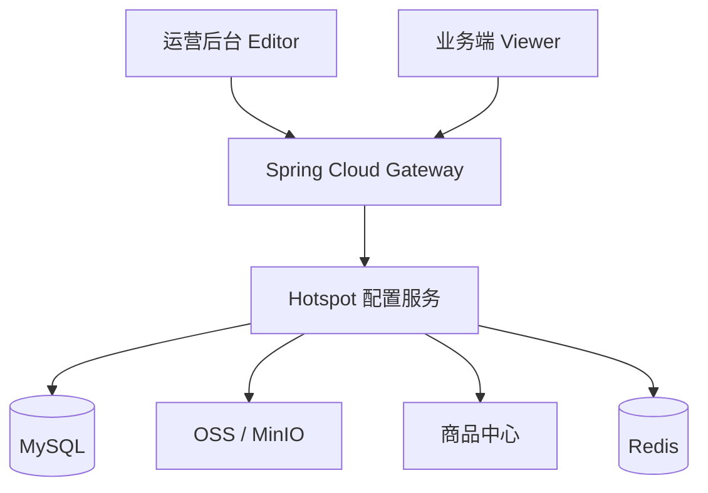

# 图片热点商品配置：生产化设计方案

## 目标

把当前可本地运行的 Demo 演进为 Spring Cloud 中可复用的业务能力：运营人员上传图片、配置商品热点、保存草稿、预览和发布；业务端只读已发布版本。当前 JSON 与本地文件只作为 `local` profile，生产环境使用 MySQL、OSS/MinIO、商品中心和 Redis。

原则：

- 点位位置跨分辨率一致。
- 草稿与已发布数据隔离，已发布版本不可变且可回滚。
- 商品中心是商品信息唯一事实来源；热点仅关联 `productId` 并保存必要发布快照。
- 租户、权限、审计、并发编辑和缓存是服务层能力，不交给前端约定。

## 架构



| 组件 | 职责 |
|---|---|
| Hotspot 配置服务 | 场景、草稿、发布、版本控制、权限和审计 |
| MySQL | 场景元数据、草稿热点、发布快照、操作日志 |
| OSS/MinIO | 原图、缩略图；数据库仅存 object key/尺寸 |
| 商品中心 | 商品搜索、上下架、图片、价格、详情链接 |
| Redis | 缓存已发布 Viewer 聚合 DTO，发布后精确失效 |

## 后端如何保存点位

### 数据表

```text
hotspot_scene
  id, tenant_id, name, image_object_key, image_width, image_height,
  status, draft_version, published_version,
  created_by, created_at, updated_by, updated_at

hotspot_draft
  id, scene_id, version, base_published_version, editor_id, updated_at

hotspot_draft_item
  id(UUID), draft_id, sort_no, x_ratio, y_ratio, label, marker_color,
  product_id, fallback_product_json, created_at, updated_at

hotspot_publish_snapshot
  id, scene_id, version, image_object_key, image_width, image_height,
  published_by, published_at

hotspot_publish_item
  id(UUID), snapshot_id, sort_no, x_ratio, y_ratio, label, marker_color,
  product_id, product_snapshot_json

hotspot_operation_log
  id, tenant_id, scene_id, action, before_json, after_json,
  operator_id, created_at
```

- 坐标字段使用 `DECIMAL(8,6)`，只允许 `[0,1]`；不保存浏览器像素。
- 草稿点位保存于 `hotspot_draft_item`，可增删改。
- 发布在一个事务内把草稿复制为 `hotspot_publish_snapshot` 和 `hotspot_publish_item`；快照不可修改。
- `product_id` 是唯一业务关联。商品 JSON 仅用于发布瞬间的展示兜底，例如商品已下架或商品中心短暂不可用。
- 所有业务表必须带 `tenant_id`，并建立 `(tenant_id, scene_id)`、`(scene_id, version)` 索引。

不再用单个 `scenes.json` 保存生产数据，因为它无法处理租户隔离、热点级审计、历史回滚和多人并发编辑。

### 保存与发布

```text
编辑器 GET 草稿(version=12)
        ↓
PUT 草稿(expectedDraftVersion=12)
        ↓
UPDATE scene ... WHERE draft_version=12
        ↓
成功：写入热点并递增为 13；失败：返回 409 冲突
        ↓
POST 发布(draftVersion=13)
        ↓
事务内创建发布快照 → 清 Redis → 发出发布事件
```

接口建议：

| 接口 | 语义 |
|---|---|
| `POST /api/hotspot-scenes` | 创建场景并确认已上传的图片 |
| `GET /api/hotspot-scenes/{id}/draft` | 返回草稿热点及 `draftVersion` |
| `PUT /api/hotspot-scenes/{id}/draft` | 全量保存热点，必须携带 `expectedDraftVersion` |
| `POST /api/hotspot-scenes/{id}/publish` | 指定草稿版本生成不可变快照 |
| `POST /api/hotspot-scenes/{id}/rollback/{version}` | 用历史快照创建新草稿，再按正常流程发布 |
| `GET /api/public/hotspot-scenes/{sceneCode}` | 只返回当前已发布 Viewer DTO |

乐观锁失败返回 `409 HOTSPOT_DRAFT_CONFLICT`。前端必须提示刷新/合并，不能静默覆盖另一位运营人员的修改。

## 前端如何根据点位渲染

### 写入相对坐标

编辑器在图片实际显示区域内计算位置：

```text
xRatio = clamp((pointerX - imageRect.left) / imageRect.width, 0, 1)
yRatio = clamp((pointerY - imageRect.top) / imageRect.height, 0, 1)
```

缩放编辑画布时只改变视觉层；`xRatio/yRatio` 不变。因此 1920px 原图、375px 手机屏和 1440px 桌面屏可复用一套点位。

### 读取与绝对定位

Viewer 只请求已发布聚合 DTO：

```json
{
  "sceneId": 101,
  "version": 7,
  "image": {"url": "https://cdn.example.com/hotspot/101/source.webp", "width": 1920, "height": 1080},
  "hotspots": [{
    "id": "4f7c...",
    "xRatio": 0.5274,
    "yRatio": 0.3118,
    "label": "智慧收银",
    "markerColor": "#2563EB",
    "productId": 88001,
    "product": {"name": "双屏智能 POS", "price": "2999.00", "detailUrl": "/products/88001"}
  }]
}
```

```javascript
marker.style.left = `${hotspot.xRatio * 100}%`;
marker.style.top = `${hotspot.yRatio * 100}%`;
marker.style.transform = 'translate(-50%, -50%)';
```

- 图片外层为 `position: relative`，点位为 `position: absolute`，且两者必须使用同一个定位上下文。
- 图片使用 `display:block; max-width:100%`；图片加载完成前不允许计算坐标。
- 视觉圆点可小，但移动端按钮点击区域必须至少 44×44px。
- 商品中心超时或商品下架时，使用发布快照渲染，并返回 `available=false` 禁用跳转。

## 图片、商品和安全

图片推荐使用“后端签发短时上传凭证 → 浏览器直传 OSS → confirm-upload”的流程。object key 由服务端生成：`tenant/{tenantId}/hotspot/{sceneId}/{uuid}`；服务端校验文件魔数、体积、像素尺寸和格式，不能信任扩展名或 Content-Type。

热点编辑只提交 `productId` 和有限兜底字段。Viewer 聚合时批量查询商品中心；结果缓存到 Redis。发布后删除相应缓存并可发送事件给 CDN 刷新、曝光/点击埋点。

详情 URL 仅允许 HTTPS 或站内根路径。Gateway 向服务传递 `tenantId/userId/roles`，服务执行 `hotspot:read`、`hotspot:edit`、`hotspot:publish`、`hotspot:delete` 校验，并把保存、发布、回滚、删除记录到审计表。

## 迁移路径

1. 抽取 `SceneRepository`、`ImageStorage`、`ProductGateway` 接口，保留当前 JSON/本地文件实现为 `local` profile。
2. 新增 MySQL 表、Flyway 迁移和 MyBatis/JPA 实现，落地草稿/快照/乐观锁。
3. 用 OSS/MinIO 替换本地文件，接入直传凭证与缩略图任务。
4. 将 Mock 商品替换为商品中心，热点只提交 `productId`。
5. 接入 Gateway 鉴权、租户隔离、RBAC、审计、Redis 缓存和 Viewer 埋点。

当前 Demo 的点击换算与百分比绝对定位可以原样保留；生产化变化集中在存储实现、API 版本控制、认证和商品聚合。
